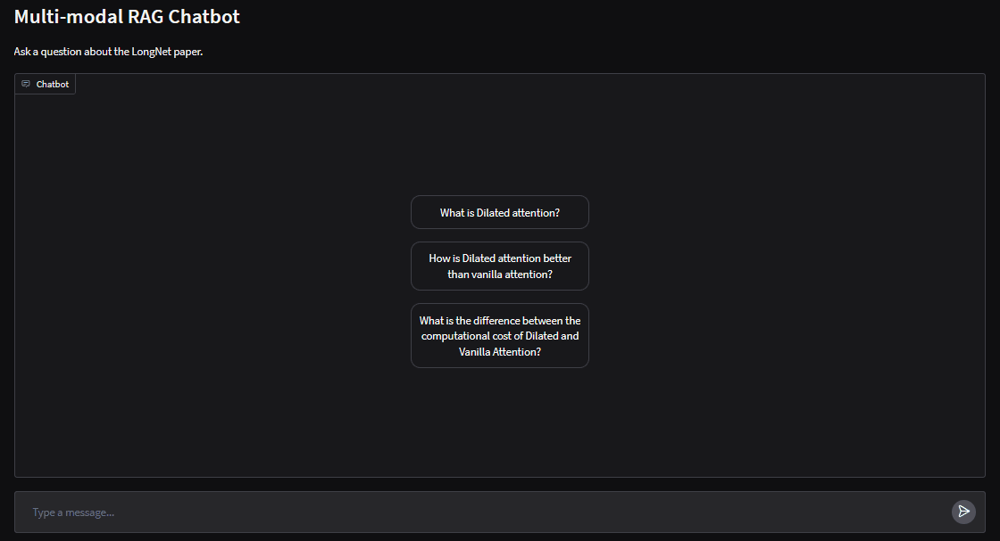

# Multimodal RAG with PDFs

This project showcases a Multimodal Retrieval-Augmented Generation (RAG) pipeline that combines the strengths of Multimodal LLms with Multimodal Vector Search and helps you chat with your PDFs.

1. This project uses  to parse images, text, and tables from documents (PDFs). 
2. GPT-4o-mini is used for summarization of the text, tables and images.
3. A Multi-Vector Retriever with  is used to store raw text and images along with their summaries for retrieval.
4. Finally, the top-k retreived documents (text, tables and images) are used to generate the response using the GPT-4o-mini model.

## Gradio App 



## Repository Structure

```
.
├── data_prep.ipynb             # Notebook for extracting data and creating the vector store (Linux only)
├── RAG_demo.ipynb              # Demo Notebook for Multimodal RAG
├── app.py                      # Gradio app                 
├── chroma_langchain_db/        # Chroma DB for retrieval
│   ├── ...    
├── utils/
│   └── app_utils.py            # Utils for the gradio app
├── pdfs/
│   └── paper.pdf               # PDF used for RAG (LongNet paper)
├── images/
│   └── ...              
├── demo_images/                 
│   ├── ...            
└── README.md                   # Project documentation 

```

## Results

List of documents retrived for the query `"What is dilated attention?"`

```
doc: 1 ---------
# Summary of Dilated Attention

## Overview
Dilated attention is a mechanism that processes input data by dividing it into segments and applying sparsification. 

## Key Components
- **Input Variables**: The input consists of three components: Query (Q), Key (K), and Value (V).
- **Segmentation**: The input is split into N segments, each of length w, resulting in segments denoted as {( ̃Qi, ̃Ki, ̃Vi)}.
- **Sparsification**: Each segment undergoes a sparsification process along the sequence dimension by selecting rows at a specified interval r.

## Computation
The computation of dilated attention can be expressed mathematically, although the specific formula is not provided in the text.

This summary encapsulates the main aspects of dilated attention, focusing on its structure and processing method, making it suitable for retrieval purposes.

doc: 2---------
# Summary of Dilated Attention Mechanism

The text discusses the implementation of dilated attention, represented as \( O = [ \hat{O}_0, \hat{O}_1, \ldots, \hat{O}_{N_w - 1} ] \). Key points include:

- **Transformation**: Dilated attention can be converted into dense attention through a gathering operation on the input (Query \( Q \), Key \( K \), Value \( V \)) and a scattering operation on the output \( \tilde{O}_i \).
- **Optimization**: This transformation allows for the reuse of existing optimizations designed for vanilla attention mechanisms, such as flash attention.
- **Efficiency**: Dilated attention offers a significant reduction in computational cost, achieving a decrease by a factor of \( N r^2 \) compared to traditional vanilla attention.

This summary encapsulates the core concepts and benefits of dilated attention, making it suitable for retrieval purposes.

doc: 3---------
# Summary of Figure 5: Runtime Comparison of Attention Mechanisms

Figure 5 illustrates the runtime performance of two attention mechanisms: **vanilla attention** and **dilated attention**, both implemented using the **FlashAttention Kernel** to enhance memory efficiency and processing speed. 

## Key Findings:
- **Dilated Attention**:
  - Exhibits almost constant latency when scaling up sequence lengths.
  - Capable of handling sequence lengths up to **1 billion tokens** by partitioning the sequence dimension and utilizing distributed systems.
  - Demonstrates a significant advantage due to its **linear complexity** and the ability to implement distributed algorithms.

- **Vanilla Attention**:
  - Experiences a **quadratic dependency** on sequence length, leading to a dramatic increase in latency as the sequence length grows.
  - Lacks a distributed algorithm, which limits its scalability and performance with longer sequences.

## Conclusion:
The results highlight the superior efficiency of dilated attention over vanilla attention, particularly in handling large-scale sequences, confirming the benefits of linear complexity and distributed processing in the LONGNET architecture.

doc: 4 ---------
# Summary of Dilated Attention with Multiple Heads

**Key Concepts:**
- **Set of Weights (w):** The weights are represented as a set \( w = \{w_0, w_1, w_2, \ldots, w_N\} \).
- **Ordering of Weights:** The weights are ordered such that \( w_i < w_{i+1} < N \) for all \( i \).
- **Dilated Attention Mechanism:** The attention patterns vary across different heads by successively shifting the positions.

**Figure Reference:**
- **Figure 3:** Illustrates the concept of dilated attention with multiple heads, highlighting the differences in attention patterns among the heads.

This summary encapsulates the essential elements of the table or text, focusing on the structure and function of dilated attention in a multi-head context, which is crucial for understanding the underlying mechanisms in attention models.

```

Answer Generated by GPT-4o-mini using the retreived documents: 

```
Dilated attention is a mechanism designed to process input data more efficiently by dividing it into segments and applying a sparsification technique. Here are the key aspects of dilated attention:

    1. Input Components: It operates on three main components: Query (Q), Key (K), and Value (V).

    2. Segmentation: The input is segmented into ( N ) parts, each of a specified length ( w ), resulting in segments denoted as ( { \tilde{Q}_i, \tilde{K}_i, \tilde{V}_i } ).

    3. Sparsification: Within each segment, sparsification is applied by selecting rows at regular intervals ( r ), which reduces the amount of data processed.

    4. Transformation: Dilated attention can be transformed into dense attention through gathering and scattering operations, allowing it to leverage existing optimizations from traditional attention mechanisms.

    5. Efficiency: It significantly reduces computational costs, achieving a decrease by a factor of ( N r^2 ) compared to vanilla attention. Additionally, dilated attention maintains almost constant latency even as sequence lengths increase, making it suitable for handling very large sequences (up to 1 billion tokens) efficiently.

    6. Multi-Head Mechanism: In a multi-head context, the attention patterns can vary across different heads by shifting positions, enhancing the model's ability to capture diverse relationships in the data.

Overall, dilated attention is characterized by its linear complexity and ability to implement distributed algorithms, making it a powerful alternative to traditional attention mechanisms, especially for large-scale applications.

```
